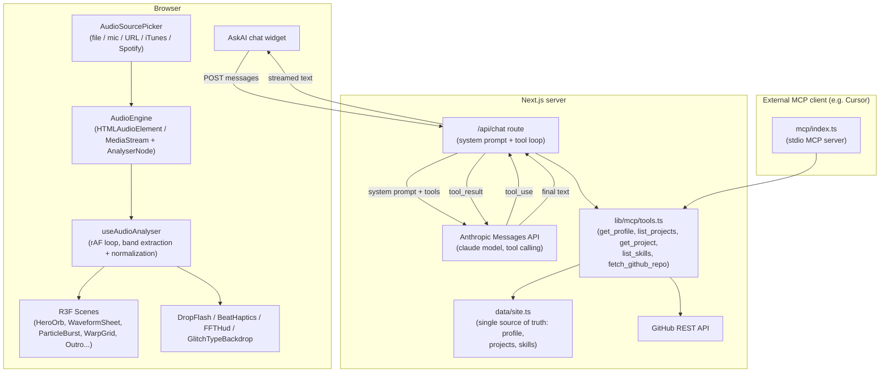

# Rahil Sheth — Portfolio

An audio-reactive "synesthesia" portfolio site: every visual on the page pulses to whatever music you feed it, and a built-in AI assistant can answer questions about the projects shown, grounded in the site's own data (and live GitHub stats).

**Live site:** [portfolio-rsheth8s-projects.vercel.app](https://portfolio-rsheth8s-projects.vercel.app/)

## What this is

This is a personal portfolio/resume site built to be memorable rather than a static page of bullet points. It's structured like an album: you scroll through seven "tracks" (hero, intro, three project sections grouped by hiring role, a skills section, and an outro/contact section), and each one has its own full-screen WebGL animation.

The twist is that all of those animations react to sound in real time. Visitors pick an audio source — upload a file, use their microphone, paste a SoundCloud/music URL, search iTunes previews, or connect Spotify — and the visuals (an orbiting sphere, a rippling waveform sheet, particle bursts, a warping grid, glitching text, an EQ-style skill bar) all bend, pulse, and flash in sync with the bass, mids, and highs of whatever is playing.

Separately, there's a chat widget in the corner ("Ask AI") that visitors can use to ask about the projects on the page — what they're built with, what they do, how many GitHub stars a repo has, which project best matches a given job requirement, and so on. The assistant is intentionally restricted to answering from the site's own project data and live GitHub lookups rather than making things up, so recruiters get accurate answers instead of a chatbot hallucinating a resume.

## Key features

- **Scroll-driven sections** — hero, intro, three project tracks (AI/ML, Data Engineering, Software Engineering), a skills "equalizer," and an outro, each rendered with its own React Three Fiber scene.
- **Shared audio-reactive engine** — one Web Audio analyser drives every visual on the page, whichever source is active (file upload, microphone, SoundCloud/other URL, iTunes preview search, or Spotify).
- **Multiple audio sources, one pipeline** — `AudioSourcePicker` lets a visitor choose a file, mic input, a pasted URL, or search + play iTunes previews; Spotify playback is supported via PKCE OAuth and synced to Spotify's own Audio Analysis API since Spotify's SDK audio doesn't expose raw waveform data.
- **Frequency-band normalization** — raw FFT bins are bucketed into perceptual bands (bass, low-mid, mid, high-mid, high) and auto-gain normalized, so both quiet and loud tracks drive the visuals across their full range.
- **Extra reactive touches** — beat-triggered haptics on supported devices, a "drop" flash effect, an FFT debug HUD, a glitching text backdrop, and a guided tour for first-time visitors.
- **Role-oriented navigation** — a sticky nav lets a recruiter jump straight to the project track matching an open role (AI/ML, Data Engineering, or Software Engineering).
- **Ask AI assistant** — a chat widget that answers visitor questions using tool calls against the portfolio's own data and the live GitHub API, not free-form generation.
- **Single source of truth for content** — all copy, profile info, project descriptions, and skills live in one file (`data/site.ts`), so the rendered page and the AI assistant's knowledge never drift apart.
- **Dual MCP entry points** — the same tool implementations that power the website chat are also exposed as a standalone Model Context Protocol (MCP) server, so tools like Cursor or Claude Desktop can query the portfolio data directly.

## How it works

### Audio-reactive visuals

1. A visitor picks an audio source in `AudioSourcePicker` (file, mic, URL, iTunes search, or Spotify).
2. `AudioEngine` (`lib/audio/AudioEngine.ts`) owns the underlying `HTMLAudioElement`/`MediaStream` and a Web Audio `AnalyserNode`, exposing raw frequency (`freq`) and time-domain (`time`) buffers each frame.
3. `useAudioAnalyser` (`lib/audio/useAudioAnalyser.ts`) runs a `requestAnimationFrame` loop that pulls a frame from the engine, buckets the FFT bins into five perceptual bands (bass/lowMid/mid/highMid/high) via `computeBands`, and normalizes them with an auto-gain normalizer (`bandNormalizer.ts`) so both quiet and loud sources produce full-range motion. The result is written into a mutable ref rather than triggering a React re-render, so React Three Fiber scenes can read it every frame inside `useFrame` without React's render cycle in the loop.
4. Special case: when playback is via the Spotify Web Playback SDK, raw audio isn't accessible in the browser, so `spotifyVisualSync.ts` instead pulls loudness/segment data from Spotify's Audio Analysis API and synthesizes equivalent bands synced to playback position.
5. Each section's Three.js scene (`components/scenes/*`) reads the current band values every frame and drives geometry, shaders, or particle behavior accordingly — e.g., the hero orb scales with bass, the waveform sheet displaces with the live waveform, particle bursts fire off transient/high-band spikes.
6. Ambient effects (`DropFlash`, `BeatHaptics`, `FFTHud`, `GlitchTypeBackdrop`) subscribe to the same band data for screen flashes, device haptics, a debug overlay, and reactive typography.

### Ask AI assistant

1. All project data — the profile, project descriptions/tech stacks/repo links, and skill groups — is defined once in `data/site.ts`. This is the sole content source for both the rendered page (`ProjectCard`, `ProjectGrid`, `SkillsEqualizer`) and the assistant.
2. `lib/mcp/tools.ts` defines a small set of tools over that data: `get_profile`, `list_projects` (optionally filtered by role track), `get_project` (by name), `list_skills`, and `fetch_github_repo` (a live call to the GitHub REST API for stars/forks/language/last-push, with an optional `GITHUB_TOKEN` for higher rate limits).
3. The chat widget (`components/ai/AskAI.tsx`) posts the conversation to `app/api/chat/route.ts`, a Next.js API route running on the Node runtime.
4. That route builds a system prompt instructing the model to answer as Rahil's assistant, ground every answer in tool results, never invent facts, and stay concise — then calls the Anthropic Messages API with the tool definitions attached.
5. If the model requests a tool call (`stop_reason: "tool_use"`), the route executes the corresponding handler in-process (reading `data/site.ts` or calling the GitHub API) and feeds the result back to the model. This loops for up to 5 tool-use rounds before falling back to an error message.
6. The final text response streams back to the client as plain text.
7. If `ANTHROPIC_API_KEY` isn't set, the endpoint returns a 503 with a friendly message and the rest of the site continues to work normally.
8. The same tool handlers are also wired into a standalone stdio MCP server (`mcp/index.ts`, run via `npm run mcp`), registered in `.cursor/mcp.json` — so an editor like Cursor can query the portfolio data as MCP tools without going through the website at all.



## Tech stack

- **Framework:** Next.js 15 (App Router), React 19, TypeScript
- **3D / graphics:** three.js, @react-three/fiber, @react-three/drei, @react-three/postprocessing
- **Audio:** native Web Audio API (`AnalyserNode`), Howler (playback), Spotify Web Playback SDK + Spotify Web API for Spotify sources
- **Animation / scroll:** Framer Motion, GSAP, Lenis (smooth scrolling)
- **Styling:** Tailwind CSS
- **AI:** Anthropic SDK (`@anthropic-ai/sdk`) for the website chat; Model Context Protocol SDK (`@modelcontextprotocol/sdk`) for the standalone MCP server; Zod for tool schema validation
- **Tooling:** ESLint, tsx (for running the MCP server), TypeScript compiler for type checking

## Project structure

```
app/
  page.tsx              # Assembles the seven scroll sections from data/site.ts
  layout.tsx             # App metadata (OG / Twitter cards)
  icon.tsx, opengraph-image.tsx   # Generated favicon / social preview image
  robots.ts, sitemap.ts
  spotify-callback/      # OAuth redirect target for Spotify PKCE flow
  api/chat/route.ts      # Ask AI endpoint — Anthropic + portfolio tools

components/
  scenes/                 # React Three Fiber WebGL scenes (one per section)
  audio/                  # Audio source picker, analyser-driven effects (haptics, flash, HUD, etc.)
  ai/AskAI.tsx             # Chat widget
  ProjectCard.tsx, ProjectGrid.tsx
  RoleNav.tsx, ScrollProgress.tsx, GuidedTour.tsx, KeyboardControls.tsx
  SkillsEqualizer.tsx, SkillsBackdrop.tsx
  theme/ThemeController.tsx

lib/
  audio/                   # AudioEngine, useAudioAnalyser, band normalization
  streaming/                # Spotify/iTunes/SoundCloud integration helpers
  mcp/                       # Shared tool definitions (register.ts, tools.ts) used by both /api/chat and the MCP server
  theme/, ui/                # Color extraction, device-tier detection, reduced-motion handling

data/site.ts               # Single source of truth: profile, projects, skill groups
mcp/index.ts                # Stdio MCP server entry point (for Cursor / Claude Desktop)
.cursor/mcp.json            # Cursor MCP client config, runs `npm run mcp`
```

## Setup / running locally

Requires Node.js and npm.

```bash
git clone https://github.com/rsheth8/portfolio.git
cd portfolio
npm install
cp .env.example .env.local   # then fill in ANTHROPIC_API_KEY (and optional vars below)
npm run dev                  # http://localhost:3000
```

### Environment variables (`.env.local`)

| Variable | Required | Purpose |
| --- | --- | --- |
| `ANTHROPIC_API_KEY` | Yes, for Ask AI | Powers the `/api/chat` assistant. Without it, the endpoint returns a 503 and the rest of the site still works. |
| `GITHUB_TOKEN` | No | Raises GitHub API rate limits for the `fetch_github_repo` tool. |
| `NEXT_PUBLIC_SPOTIFY_CLIENT_ID` | No | Enables Spotify Premium full-track playback (PKCE OAuth, no client secret needed). Requires a Spotify Developer app with the correct redirect URI. |
| `NEXT_PUBLIC_SPOTIFY_REDIRECT_URI` | No | Override for the Spotify OAuth redirect URI if your dev server port varies. |

### npm scripts

| Command | Does |
| --- | --- |
| `npm run dev` | Start the Next.js dev server |
| `npm run build` | Production build |
| `npm run start` | Serve the production build |
| `npm run lint` | ESLint |
| `npm run typecheck` | `tsc --noEmit` |
| `npm run mcp` | Run the standalone MCP server over stdio (for Cursor / other MCP clients — not used by the live website) |

## Notable implementation details

- **Content lives in one file.** `data/site.ts` is the single source of truth for the profile, project descriptions/tech/links, and skill groups. The rendered page components and the AI assistant's tool handlers both read from it directly, so they can never fall out of sync — edit one file to update both.
- **The AI assistant is deliberately tool-grounded, not free-form.** The system prompt explicitly instructs the model to answer from tool results and portfolio data and never invent facts, dates, or metrics; if it doesn't know something it's told to point the visitor to the site owner's email instead.
- **Two entry points share one tool implementation.** `lib/mcp/tools.ts` is used both by the website's `/api/chat` route (in-process, no extra server needed) and by a standalone MCP stdio server (`mcp/index.ts`) that editors like Cursor can spawn — avoiding duplicating the tool logic.
- **Audio state updates bypass React's render cycle.** `useAudioAnalyser` writes into a mutable ref every animation frame rather than calling `setState`, so the 60fps audio-reactive animation loop inside R3F's `useFrame` doesn't trigger React re-renders on every frame — a common performance pattern for real-time WebGL driven by external data.
- **Spotify playback is handled as a special case.** Because the Spotify Web Playback SDK doesn't expose raw PCM/FFT data to the browser, band data for Spotify sources is derived instead from Spotify's own Audio Analysis API, synced to the live playback position, and is already loudness-normalized (so the normal auto-gain step is skipped for that path).
- **Scenes are lazily loaded.** `LazyScene` defers mounting each WebGL scene (with a lightweight gradient poster shown first) so the initial page load isn't blocked by loading Three.js scenes for sections the visitor hasn't scrolled to yet.
- **Device-aware rendering.** `lib/ui/deviceTier.ts` and `useReducedMotion` allow scenes to scale down effects on lower-powered devices or when the visitor has requested reduced motion.
